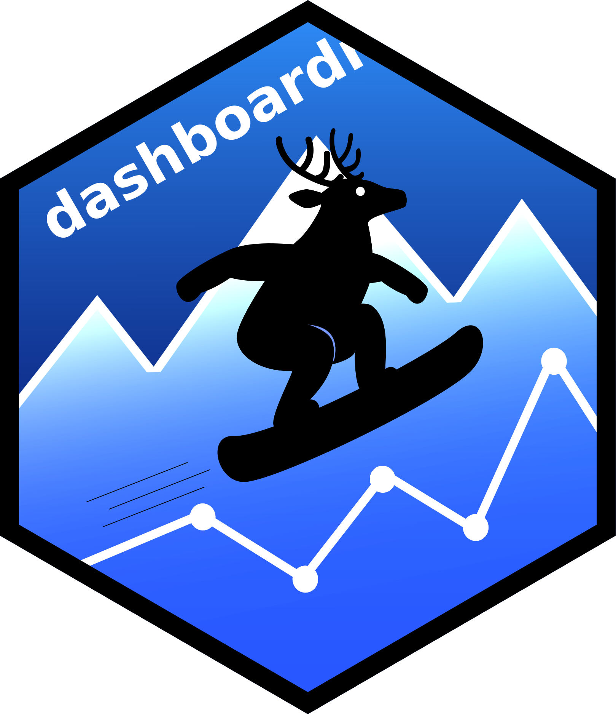

<!-- README.md is generated from README.Rmd. Please edit that file -->

```{r, include = FALSE, warning=FALSE, message=F}
knitr::opts_chunk$set(
  collapse = TRUE,
  comment = "#>",
  fig.path = "man/figures/README-",
  out.width = "100%",
  eval = FALSE
)
```

# dashboardr 

<!-- badges: start -->
[](https://lifecycle.r-lib.org/articles/stages.html#experimental)
[](https://favstats.r-universe.dev/dashboardr)
[](https://app.codecov.io/gh/favstats/dashboardr)
<!-- badges: end -->

**dashboardr** lets you build interactive HTML dashboards from R using a simple, composable grammar. Think of it like building with Lego blocks:

- **No web development needed** - just R code
- **Interactive charts** powered by Highcharts
- **Beautiful themes** from Bootswatch
- **Flexible layouts** with tabs, pages, and navigation

## Installation

```{r install, eval = FALSE}
# From R-Universe (recommended — includes pre-built binaries)
install.packages("dashboardr",
  repos = c("https://favstats.r-universe.dev", "https://cloud.r-project.org"))

# Or from GitHub
# install.packages("pak")
pak::pak("favstats/dashboardr")
```

### Optional: Install gssr for tutorials

The tutorials and demos use the `gssr` package (General Social Survey data). Install it from r-universe:

```{r gssr-install, eval = FALSE}
install.packages('gssr', repos = c('https://kjhealy.r-universe.dev', 'https://cloud.r-project.org'))

# Also recommended: install gssrdoc for documentation
install.packages('gssrdoc', repos = c('https://kjhealy.r-universe.dev', 'https://cloud.r-project.org'))
```

## The Three Layers

Just as ggplot2 builds plots from layers, dashboardr builds dashboards from three layers:

| Layer | Purpose | Key Functions |
|-------|---------|---------------|
| **Content** | What to show (charts, text) | `create_content()`, `add_viz()`, `add_text()` |
| **Page** | Where content lives | `create_page()`, `add_content()` |
| **Dashboard** | Final output + config | `create_dashboard()`, `add_pages()` |

Each layer flows into the next using pipes (`%>%`).

## Quick Start

```{r quickstart, eval=FALSE}
library(dashboardr)
library(dplyr)

# Prepare data
data <- mtcars %>% mutate(cyl_label = paste(cyl, "cylinders"))

# LAYER 1: Content - what to show
charts <- create_content(data = data, type = "bar") %>%
add_viz(x_var = "cyl_label", title = "Cylinders", tabgroup = "overview") %>%
  add_viz(x_var = "gear", title = "Gears", tabgroup = "overview")

# LAYER 2: Pages - where content lives
home <- create_page("Home", is_landing_page = TRUE) %>%
  add_text("# Car Dashboard", "", "Explore the mtcars dataset.")

analysis <- create_page("Analysis", data = data) %>%
  add_content(charts)

# LAYER 3: Dashboard - final output
create_dashboard(
  title = "Car Explorer",
  output_dir = "my_dashboard",
  theme = "flatly"
) %>%
  add_pages(home, analysis) %>%
  generate_dashboard(render = TRUE, open = "browser")
```

That's it! A complete interactive dashboard.

## Visualization Types

| Function | Description | Use Case |
|----------|-------------|----------|
| `viz_bar()` | Bar charts | Category comparisons |
| `viz_histogram()` | Distributions | Age, income, scores |
| `viz_stackedbar()` | Stacked bars | Likert scales, compositions |
| `viz_stackedbars()` | Multiple stacked bars | Survey question batteries |
| `viz_timeline()` | Time series | Trends over time |
| `viz_heatmap()` | 2D heatmap | Correlations, matrices |
| `viz_scatter()` | Scatter plots | Relationships between variables |
| `viz_treemap()` | Treemaps | Hierarchical proportions |
| `viz_map()` | Choropleth maps | Geographic data |

## Function Overview

dashboardr uses consistent naming so you always know what a function does:

| Prefix | Purpose | Examples |
|--------|---------|----------|
| `create_*` | **Create containers** - Start a new dashboard, page, or content collection | `create_dashboard()`, `create_page()`, `create_content()` |
| `add_*` | **Add to containers** - Insert visualizations, text, pages, or content | `add_viz()`, `add_text()`, `add_page()`, `add_content()` |
| `viz_*` | **Build visualizations** - Create individual charts (bar, histogram, timeline, etc.) | `viz_bar()`, `viz_histogram()`, `viz_timeline()` |
| `set_*` | **Modify properties** - Change settings like tab labels | `set_tabgroup_labels()` |
| `generate_*` | **Produce output** - Create Quarto files and render to HTML | `generate_dashboard()` |
| `theme_*` | **Apply styling** - Set visual themes | `theme_modern()`, `theme_clean()` |
| `combine_*` | **Merge collections** - Join multiple content collections | `combine_content()`, `combine_viz()` |
| `preview()` | **Quick look** - See content without generating files | `preview()` |

### The Typical Pattern

```r
# 1. CREATE a container
create_content(data = my_data, type = "bar") %>%
  # 2. ADD elements to it
  add_viz(x_var = "category", title = "My Chart") %>%
  add_text("## Summary", "Key findings here.")
```

## Documentation

| Topic | Resource |
|-------|----------|
| Getting started | `vignette("getting-started")` |
| Content & visualizations | `vignette("content-collections")` |
| Pages | `vignette("pages")` |
| Dashboards | `vignette("dashboards")` |
| Advanced features | `vignette("advanced-features")` |
| Publishing | `vignette("publishing_dashboards")` |

## Live Demos

See dashboardr in action:

1. [**Tutorial Dashboard**](https://favstats.github.io/dashboardr/live-demos/tutorial/docs/index.html) - Beginner-friendly demo
2. [**Showcase Dashboard**](https://favstats.github.io/dashboardr/live-demos/showcase/docs/index.html) - Advanced features

Both use real data from the General Social Survey (GSS).

### Real-World Dashboard

- [**DigIQ Monitor**](https://www.digiqmonitor.nl/) - The first public dashboard built with dashboardr! Digital competence insights for Dutch citizens, featuring 11 dimensions, multilingual support, and paginated visualizations.

## Contributing

Contributions welcome! Please submit a Pull Request.

## License

MIT License - see [LICENSE.md](LICENSE.md)
